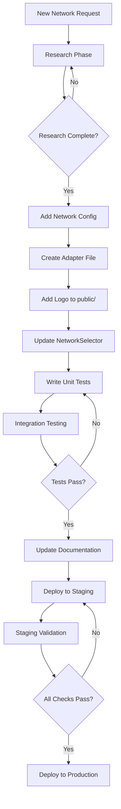

# Blockchain Integration Roadmap

## Awaken Connect - Multi-Chain Expansion Strategy

**Document Version:** 2.0  
**Created:** 2026-02-03  
**Last Updated:** 2026-02-03  
**Status:** Planning Complete

---

## Table of Contents

1. [Executive Summary](#executive-summary)
2. [Soneium Integration Technical Roadmap](#sonium-integration-technical-roadmap)
3. [Queue-Based Expansion Plan](#queue-based-expansion-plan)
4. [Scalable Architecture Design](#scalable-architecture-design)
5. [UI/UX Checklist for Interface Stability](#uiux-checklist-for-interface-stability)
6. [Code Examples and Patterns](#code-examples-and-patterns)
7. [Implementation Checklist](#implementation-checklist)

---

## Executive Summary

This document outlines the comprehensive technical roadmap for expanding Awaken Connect's blockchain integration capabilities. The strategy prioritizes **Soneium** (Sony Chain) as the next network due to its EVM compatibility and growing gaming/NFT ecosystem, following the established Celo adapter pattern.

### Current State

- **Supported Networks:** Creditcoin, Humanity Protocol, Celo (3 total)
- **Adapter Pattern:** Network-specific adapters in `src/adapters/{network}.ts`
- **Network Configuration:** Hardcoded in `src/components/NetworkSelector.tsx`
- **Transaction Parsing:** Unified `ParsedTransaction` interface in `src/utils/csv.ts`

### Goals

1. Add Soneium network support with full compatibility
2. Reuse proven Celo adapter patterns for EVM chains
3. Maintain UI/UX stability across all screen sizes
4. Document lessons learned for continuous improvement

---

## Soneium Integration Technical Roadmap

### Phase 1: Research & Discovery

**Soneium Blockchain Architecture:**

| Aspect | Details |
|--------|---------|
| **Type** | EVM-compatible L2 |
| **Consensus** | Proof of Stake |
| **Block Time** | ~2 seconds |
| **Native Asset** | SON |
| **Explorer** | Soneium explorer (Blockscout-based) |

**API Endpoints:**

```typescript
// Soneium configuration
const SONEIUM_CONFIG = {
    mainnet: {
        rpc: 'https://sonium-rpc.example.com', // TBD
        explorer: 'https://sonium-explorer.blockscout.com',
        api: 'https://sonium-explorer.blockscout.com/api',
        chainId: TBD
    },
    testnet: {
        rpc: 'https://sonium-testnet-rpc.example.com', // TBD
        explorer: 'https://sonium-testnet-explorer.blockscout.com',
        api: 'https://sonium-testnet-explorer.blockscout.com/api',
        chainId: TBD
    }
};
```

#### 1.1 Transaction Indexing Approaches

1. **Blockscout-based API** (Recommended for MVP)
   - Endpoint pattern: `{explorer}/api?module=account&action=txlist&address={address}`
   - Similar to Creditcoin and Celo adapter patterns
   - Returns: `from`, `to`, `value`, `input`, `gasUsed`, `gasPrice`, `timeStamp`, `hash`

2. **Native RPC Methods**
   - `eth_getTransactionByHash`
   - `eth_getLogs` for event filtering
   - Requires pagination logic

#### 1.2 Soneium-Specific Transaction Types

```typescript
interface SoneiumTransactionCharacteristics {
    // Native transfers
    nativeTransfer: {
        nativeAsset: 'SON',
        decimals: 18,
        methodId: '0x' // Empty input for simple transfers
    };
    
    // Sony ecosystem operations
    sonyOperations: {
        // TBD: Sony-specific method signatures
    };
    
    // Fee model
    feeModel: {
        type: 'gas', // EIP-1559 compatible
        currency: 'SON'
    };
}
```

---

### Phase 2: Adapter Architecture

Create `src/adapters/sonium.ts` following the Celo pattern:

```typescript
import { ActionType, type ParsedTransaction, TransactionStatus } from '../utils/csv';
import { mapToAwakenLabel } from '../utils/awakenLabels';

const API_ENDPOINT = 'https://sonium-explorer.blockscout.com/api';

export async function fetchSoniumTransactions(
    address: string,
    options?: { isTestnet?: boolean }
): Promise<ParsedTransaction[]> {
    const isTestnet = options?.isTestnet ?? false;
    const baseUrl = isTestnet 
        ? 'https://sonium-testnet-explorer.blockscout.com/api'
        : API_ENDPOINT;
    
    const url = `${baseUrl}?module=account&action=txlist&address=${address}`;
    
    const response = await fetch(url);
    if (!response.ok) {
        throw new Error(`Soneium Explorer API Error: ${response.statusText}`);
    }
    
    const json = await response.json();
    
    if (json.status === '0' && json.message !== 'No transactions found') {
        throw new Error(`Blockscout Error: ${json.message}`);
    }
    
    const transactions = json.result || [];
    return transactions.map((tx: any) => parseSoniumTransaction(tx, address, isTestnet));
}

function parseSoniumTransaction(tx: any, userAddress: string, isTestnet: boolean): ParsedTransaction {
    const isSender = tx.from.toLowerCase() === userAddress.toLowerCase();
    const decimals = 18;
    
    const valueStr = formatUnits(tx.value, decimals);
    const fee = formatUnits(
        (BigInt(tx.gasUsed) * BigInt(tx.gasPrice)).toString(),
        decimals
    );
    
    const txType = detectSoniumTransactionType(tx);
    let actionType = isSender ? ActionType.SEND : ActionType.RECEIVE;
    if (['exactInputSingle', 'exactOutputSingle', 'swap'].includes(txType)) {
        actionType = ActionType.SWAP;
    } else if (txType !== 'native_transfer' && txType !== 'token_transfer') {
        actionType = ActionType.CONTRACT;
    }
    
    return {
        id: tx.hash,
        date: new Date(parseInt(tx.timeStamp) * 1000),
        receivedQuantity: isSender ? '' : valueStr,
        receivedCurrency: isSender ? '' : 'SON',
        sentQuantity: isSender ? valueStr : '',
        sentCurrency: isSender ? 'SON' : '',
        feeAmount: isSender ? fee : '',
        feeCurrency: isSender ? 'SON' : '',
        hash: tx.hash,
        notes: buildSoniumNotes(tx, isSender, txType),
        status: mapSoniumStatus(tx.txreceipt_status),
        type: actionType,
        link: `${isTestnet ? 'https://sonium-testnet-explorer.blockscout.com' : 'https://sonium-explorer.blockscout.com'}/tx/${tx.hash}`,
        tag: mapToAwakenLabel(txType, txType === 'native_transfer', isSender)
    };
}

function detectSoniumTransactionType(tx: any): string {
    const input = tx.input || '0x';
    const methodId = input.slice(0, 10).toLowerCase();
    
    const methodSignatures: Record<string, string> = {
        '0xa9059cbb': 'token_transfer',
        '0x23b872dd': 'token_transferFrom',
        '0x095ea7b3': 'token_approve',
    };
    
    if (!tx.to || tx.to === '') {
        return 'contract_creation';
    }
    
    if (input && input !== '0x' && input.length > 2) {
        const detectedMethod = methodSignatures[methodId];
        if (detectedMethod) return detectedMethod;
        return 'contract_call';
    }
    
    return 'native_transfer';
}

function mapSoniumStatus(status: string | undefined): TransactionStatus {
    if (status === '1') return TransactionStatus.SUCCESS;
    if (status === '0') return TransactionStatus.FAILED;
    return TransactionStatus.UNKNOWN;
}

function buildSoniumNotes(tx: any, isSender: boolean, txType: string): string {
    const typeLabels: Record<string, string> = {
        'native_transfer': isSender ? 'Sent SON' : 'Received SON',
        'token_transfer': 'Token Transfer',
        'contract_creation': 'Contract Creation',
        'contract_call': 'Contract Interaction',
    };
    
    return typeLabels[txType] || (isSender ? 'Sent SON' : 'Received SON');
}

function formatUnits(value: string, decimals: number): string {
    if (!value || value === '0') return '0';
    if (value.startsWith('-')) return '0';
    
    const val = BigInt(value);
    if (val === BigInt(0)) return '0';
    
    const str = val.toString().padStart(decimals + 1, '0');
    const integerPart = str.slice(0, -decimals);
    const fractionalPart = str.slice(-decimals).replace(/0+$/, '');
    
    return fractionalPart ? `${integerPart}.${fractionalPart}` : integerPart;
}
```

#### 2.1 Address Validation

Soneium uses the same address format as Ethereum (0x...):

```typescript
export function validateSoniumAddress(address: string): boolean {
    const soniumAddressRegex = /^0x[a-fA-F0-9]{40}$/;
    return soniumAddressRegex.test(address);
}
```

---

### Phase 3: Implementation

#### 3.1 App.tsx Integration

```typescript
// Add import
import { fetchSoniumTransactions } from './adapters/sonium';

// In handleFetch function
const handleFetch = async (address: string) => {
    // ... validation code ...
    
    try {
        let data: ParsedTransaction[] = [];
        if (network === 'creditcoin') {
            data = await fetchCreditcoinTransactions(address);
        } else if (network === 'humanity') {
            data = await fetchHumanityTransactions(address);
        } else if (network === 'celo') {
            data = await fetchCeloTransactions(address);
        } else if (network === 'sonium') {
            data = await fetchSoniumTransactions(address);
        }
        
        if (data.length === 0) {
            setError('No transactions found for this address');
        }
        
        setTransactions(data);
    } catch (e: any) {
        setError(`Error fetching transactions: ${e.message}`);
    } finally {
        setIsLoading(false);
    }
};
```

#### 3.2 NetworkSelector.tsx Update

```typescript
const NETWORKS: NetworkOption[] = [
    {
        id: 'creditcoin',
        name: 'Creditcoin',
        logo: '/creditcoin-logo.png'
    },
    {
        id: 'humanity',
        name: 'Humanity Protocol',
        logo: '/humanity-logo.avif'
    },
    {
        id: 'celo',
        name: 'Celo',
        logo: '/celo-logo.svg'
    },
    {
        id: 'sonium',
        name: 'Soneium',
        logo: '/sonium-logo.png' // Add this file
    }
];
```

---

### Phase 4: Testing & Validation

#### 4.1 Unit Tests for Sonium Adapter

```typescript
// tests/sonium.test.ts
import { fetchSoniumTransactions, validateSoniumAddress } from '../src/adapters/sonium';

describe('Sonium Adapter', () => {
    describe('validateSoniumAddress', () => {
        it('should validate correct Sonium addresses', () => {
            expect(validateSoniumAddress('0x742d35Cc6634C0532925a3b844Bc9e7595f2bD48')).toBe(true);
        });
        
        it('should reject invalid addresses', () => {
            expect(validateSoniumAddress('0x123')).toBe(false);
            expect(validateSoniumAddress('not-an-address')).toBe(false);
        });
    });
    
    describe('fetchSoniumTransactions', () => {
        it('should fetch transactions from testnet', async () => {
            const testAddress = '0x742d35Cc6634C0532925a3b844Bc9e7595f2bD48';
            const transactions = await fetchSoniumTransactions(testAddress, { isTestnet: true });
            expect(Array.isArray(transactions)).toBe(true);
        });
    });
});
```

#### 4.2 Integration Test Addresses

| Network | Address | Expected Transactions |
|---------|---------|----------------------|
| Soneium Mainnet | `0x742d35Cc6634C0532925a3b844Bc9e7595f2bD48` | Various |
| Soneium Testnet | `0xa0b86991c6218b36c1d19d4a2e9eb0ce3606eb48` | Test transactions |

---

### Phase 5: Production Release

#### 5.1 Pre-Deployment Checklist

- [ ] Add Sonium logo to `public/sonium-logo.png`
- [ ] Update NetworkSelector with Sonium option
- [ ] Run `npm run build` - no errors
- [ ] Test with real Sonium addresses
- [ ] Verify CSV export compatibility
- [ ] Update "How it Works" panel if needed
- [ ] Deploy to production

---

## Queue-Based Expansion Plan

### Queue Position 4: Soneium (Sony Chain)

**Estimated Integration Time:** 4-5 days  
**Status:** Next Priority

Soneium is Sony's Ethereum L2 with strong gaming/NFT ecosystem integration. Key considerations:

1. **EVM Compatibility:** Can reuse Celo adapter pattern directly
2. **Blockscout Explorer:** Likely available for transaction indexing
3. **Sony Ecosystem:** Identify Sony-specific tokens and operations
4. **Bridge Operations:** L2 bridge transactions

---

### Queue Position 5: Kala

**Estimated Integration Time:** 3-4 days

```typescript
interface KalaResearch {
    networkType: string;
    rpcEndpoints: {
        mainnet: string;
        testnet?: string;
    };
    explorerApi: {
        baseUrl: string;
        type: string;
    };
    nativeAsset: {
        symbol: string;
        decimals: number;
    };
    consensusMechanism: string;
}
```

---

### Queue Management Rules

```typescript
interface QueueRules {
    completionRequirement: '100%' | '90% with documented issues';
    documentationRequirement: {
        lessonsLearned: boolean;
        adapterPatternUpdates: boolean;
        knownIssues: boolean;
    };
    parallelWorkAllowed: boolean;
}

const QUEUE_CONFIG: QueueRules = {
    completionRequirement: '100%',
    documentationRequirement: {
        lessonsLearned: true,
        adapterPatternUpdates: true,
        knownIssues: true
    },
    parallelWorkAllowed: false // Focus on one at a time
};
```

---

## Scalable Architecture Design

### Adapter Pattern Requirements

Each network must implement the following interface:

```typescript
interface NetworkAdapter {
    // Fetch all transactions for an address
    fetchTransactions(
        address: string,
        options?: AdapterOptions
    ): Promise<ParsedTransaction[]>;
    
    // Parse individual transaction
    parseTransaction(
        rawTx: any,
        userAddress: string
    ): ParsedTransaction;
    
    // Validate address format
    validateAddress(address: string): boolean;
    
    // Get network configuration
    getNetworkConfig(): NetworkConfig;
}

interface AdapterOptions {
    isTestnet?: boolean;
    startBlock?: number;
    endBlock?: number;
    page?: number;
    limit?: number;
}

interface NetworkConfig {
    id: Network;
    name: string;
    nativeCurrency: {
        symbol: string;
        decimals: number;
    };
    rpcUrl: string;
    explorerUrl: string;
    logos: {
        light: string;
        dark?: string;
    };
}
```

### File Structure

```
src/
├── adapters/
│   ├── creditcoin.ts    // Existing
│   ├── fuel.ts          // Existing
│   ├── humanity.ts      // Existing
│   ├── celo.ts          // Priority 1 - COMPLETED
│   ├── sonium.ts        // Priority 4 - NEXT
│   └── kala.ts          // Queue Position 5
├── config/
│   └── supportedNetworks.ts  // NEW - Centralized config
├── types/
│   └── network.ts       // NEW - Shared types
```

### Configuration-Driven Approach

Create `src/config/supportedNetworks.ts`:

```typescript
import { Network } from '../components/NetworkSelector';

export interface NetworkMetadata {
    id: Network;
    name: string;
    shortName: string;
    chainId: number;
    isTestnetSupported: boolean;
    nativeCurrency: {
        symbol: string;
        name: string;
        decimals: number;
        coinGeckoId?: string;
    };
    rpc: {
        mainnet: string;
        testnet?: string;
    };
    explorer: {
        mainnet: string;
        testnet?: string;
        apiPath: string; // e.g., 'api' for Blockscout
    };
    features: {
        stablecoins: string[];
        staking: boolean;
        governance: boolean;
    };
    logo: {
        light: string;
        dark?: string;
    };
    displayOrder: number;
}

export const SUPPORTED_NETWORKS: NetworkMetadata[] = [
    {
        id: 'creditcoin',
        name: 'Creditcoin',
        shortName: 'CTC',
        chainId: 2024,
        isTestnetSupported: false,
        nativeCurrency: {
            symbol: 'CTC',
            name: 'Creditcoin',
            decimals: 18,
            coinGeckoId: 'creditcoin'
        },
        rpc: {
            mainnet: 'https://creditcoin.blockscout.com/api'
        },
        explorer: {
            mainnet: 'https://creditcoin.blockscout.com',
            apiPath: 'api'
        },
        features: {
            stablecoins: [],
            staking: true,
            governance: false
        },
        logo: {
            light: '/creditcoin-logo.png'
        },
        displayOrder: 1
    },
    {
        id: 'celo',
        name: 'Celo',
        shortName: 'CELO',
        chainId: 42220,
        isTestnetSupported: true,
        nativeCurrency: {
            symbol: 'CELO',
            name: 'Celo',
            decimals: 18,
            coinGeckoId: 'celo'
        },
        rpc: {
            mainnet: 'https://forno.celo.org',
            testnet: 'https://alfajores-forno.celo.org'
        },
        explorer: {
            mainnet: 'https://explorer.celo.org',
            testnet: 'https://alfajores.explorer.celo.org',
            apiPath: 'api'
        },
        features: {
            stablecoins: ['cUSD', 'cEUR', 'cREAL'],
            staking: true,
            governance: true
        },
        logo: {
            light: '/celo-logo.svg'
        },
        displayOrder: 2
    },
    {
        id: 'sonium',
        name: 'Soneium',
        shortName: 'SON',
        chainId: TBD,
        isTestnetSupported: true,
        nativeCurrency: {
            symbol: 'SON',
            name: 'Soneium',
            decimals: 18
        },
        rpc: {
            mainnet: 'https://sonium-rpc.example.com',
            testnet: 'https://sonium-testnet-rpc.example.com'
        },
        explorer: {
            mainnet: 'https://sonium-explorer.blockscout.com',
            testnet: 'https://sonium-testnet-explorer.blockscout.com',
            apiPath: 'api'
        },
        features: {
            stablecoins: [],
            staking: true,
            governance: false
        },
        logo: {
            light: '/sonium-logo.png'
        },
        displayOrder: 3
    }
];

export function getNetworkById(id: Network): NetworkMetadata | undefined {
    return SUPPORTED_NETWORKS.find(n => n.id === id);
}

export function getEnabledNetworks(): NetworkMetadata[] {
    return SUPPORTED_NETWORKS.sort((a, b) => a.displayOrder - b.displayOrder);
}
```

### Future Network Addition Process



---

## UI/UX Checklist for Interface Stability

### Before Each Network Addition

#### Mobile Viewport (375px)

```markdown
- [ ] Test NetworkSelector dropdown opens correctly
- [ ] Verify dropdown menu doesn't go off-screen
- [ ] Check "How it Works" panel stacks vertically
- [ ] Verify filter bar doesn't break layout
- [ ] Test transaction table scrolls horizontally if needed
- [ ] Check address input doesn't overflow viewport
- [ ] Verify buttons are tappable (min 44px touch target)
```

#### Tablet Viewport (768px)

```markdown
- [ ] Test NetworkSelector dropdown positioning
- [ ] Verify two-column layout for config card
- [ ] Check "How it Works" panel fits properly
- [ ] Test filter bar on tablet width
- [ ] Verify transaction table responsive behavior
- [ ] Check spacing and padding consistency
```

#### Desktop Viewport (1200px+)

```markdown
- [ ] Test NetworkSelector dropdown on wide screens
- [ ] Verify "How it Works" panel layout
- [ ] Check filter bar full width behavior
- [ ] Test transaction table with many columns
- [ ] Verify export buttons spacing
- [ ] Check horizontal scroll behavior
```

### After Each Network Addition

#### Functional Testing

```markdown
- [ ] Run `npm run build` - no TypeScript errors
- [ ] Test wallet input validation for new network addresses
- [ ] Test transaction fetching with known test addresses
- [ ] Verify CSV export generates correct format
- [ ] Test empty state messaging
- [ ] Test loading states (skeleton, spinner)
- [ ] Test error states (invalid address, network timeout)
- [ ] Test address copy functionality
- [ ] Test transaction link navigation
```

#### Visual Regression Testing

```markdown
- [ ] Compare screenshots before/after changes
- [ ] Verify network logos load correctly
- [ ] Check currency symbols display properly
- [ ] Verify transaction type badges render correctly
- [ ] Test hover states on interactive elements
- [ ] Check dark mode compatibility if applicable
```

### Common Issues to Avoid

| Issue | Prevention |
|-------|------------|
| Dropdown going off-screen on mobile | Use `absolute` positioning with `left-0` and `w-full` |
| Network logos not loading | Add `onError` handler and fallback text |
| Address validation breaking | Use network-specific regex, not universal |
| Transaction parsing errors | Add comprehensive type guards and null checks |
| Horizontal scroll on mobile | Use `overflow-x-auto` with proper max-width |
| Network selector too wide | Set `min-w-[180px]` and `max-w-[200px]` |

---

## Code Examples and Patterns

### Transaction Parsing Pattern

```typescript
// Template for new network adapters
import { ActionType, type ParsedTransaction, TransactionStatus } from '../utils/csv';
import { mapToAwakenLabel } from '../utils/awakenLabels';

const API_ENDPOINT = 'https://explorer.example.com/api';

export async function fetchNetworkTransactions(
    address: string,
    options?: { isTestnet?: boolean }
): Promise<ParsedTransaction[]> {
    const baseUrl = options?.isTestnet 
        ? 'https://testnet.explorer.example.com/api'
        : API_ENDPOINT;
    const url = `${baseUrl}?module=account&action=txlist&address=${address}`;
    
    const response = await fetch(url);
    if (!response.ok) {
        throw new Error(`Network API Error: ${response.statusText}`);
    }
    
    const json = await response.json();
    
    if (json.status === '0' && json.message !== 'No transactions found') {
        throw new Error(`Explorer Error: ${json.message}`);
    }
    
    const transactions = json.result || [];
    return transactions.map((tx: any) => parseTransaction(tx, address));
}

function parseTransaction(tx: any, userAddress: string): ParsedTransaction {
    const isSender = tx.from.toLowerCase() === userAddress.toLowerCase();
    const decimals = 18;
    
    const valueStr = formatUnits(tx.value, decimals);
    const fee = formatUnits(
        (BigInt(tx.gasUsed) * BigInt(tx.gasPrice)).toString(),
        decimals
    );
    
    const txType = detectTransactionType(tx);
    
    let actionType = isSender ? ActionType.SEND : ActionType.RECEIVE;
    if (['swap', 'exactInputSingle'].includes(txType)) {
        actionType = ActionType.SWAP;
    } else if (txType !== 'native_transfer') {
        actionType = ActionType.CONTRACT;
    }
    
    return {
        id: tx.hash,
        date: new Date(parseInt(tx.timeStamp) * 1000),
        receivedQuantity: isSender ? '' : valueStr,
        receivedCurrency: isSender ? '' : 'NATIVE',
        sentQuantity: isSender ? valueStr : '',
        sentCurrency: isSender ? 'NATIVE' : '',
        feeAmount: isSender ? fee : '',
        feeCurrency: isSender ? 'NATIVE' : '',
        hash: tx.hash,
        notes: buildNotes(tx, isSender, txType),
        status: mapStatus(tx.txreceipt_status),
        type: actionType,
        link: `${getExplorerUrl(options?.isTestnet)}/tx/${tx.hash}`,
        tag: mapToAwakenLabel(txType, txType === 'native_transfer', isSender)
    };
}

function detectTransactionType(tx: any): string {
    const input = tx.input || '0x';
    const methodId = input.slice(0, 10).toLowerCase();
    
    const methodSignatures: Record<string, string> = {
        '0xa9059cbb': 'token_transfer',
        '0x23b872dd': 'token_transferFrom',
    };
    
    if (!tx.to) return 'contract_creation';
    if (input && input !== '0x') {
        return methodSignatures[methodId] || 'contract_call';
    }
    return 'native_transfer';
}

function buildNotes(tx: any, isSender: boolean, txType: string): string {
    const labels: Record<string, string> = {
        native_transfer: isSender ? 'Sent NATIVE' : 'Received NATIVE',
        token_transfer: 'Token Transfer',
        contract_call: 'Contract Interaction',
    };
    return labels[txType] || 'Transaction';
}

function mapStatus(status: string): TransactionStatus {
    if (status === '1') return TransactionStatus.SUCCESS;
    if (status === '0') return TransactionStatus.FAILED;
    return TransactionStatus.UNKNOWN;
}

function formatUnits(value: string, decimals: number): string {
    if (!value || value === '0') return '0';
    if (value.startsWith('-')) return '0';
    
    const val = BigInt(value);
    if (val === BigInt(0)) return '0';
    
    const str = val.toString().padStart(decimals + 1, '0');
    const integerPart = str.slice(0, -decimals);
    const fractionalPart = str.slice(-decimals).replace(/0+$/, '');
    
    return fractionalPart ? `${integerPart}.${fractionalPart}` : integerPart;
}
```

### Address Validation Pattern

```typescript
export function validateNetworkAddress(address: string): boolean {
    // EVM-compatible (most common)
    if (address.startsWith('0x') && address.length === 42) {
        return /^0x[a-fA-F0-9]{40}$/.test(address);
    }
    
    // Fuel-specific
    if (address.startsWith('fuel') || address.startsWith('0x')) {
        return address.length >= 42;
    }
    
    return false;
}
```

---

## Implementation Checklist

### Celo Integration Complete Checklist

```markdown
## Phase 1: Research & Discovery
- [x] Analyze Celo blockchain architecture
- [x] Identify RPC endpoints and block explorers
- [x] Determine transaction indexing capabilities
- [x] Map Celo-specific transaction types
- [x] Research Celo stablecoin assets

## Phase 2: Adapter Architecture Design
- [x] Create src/adapters/celo.ts
- [x] Define Network enum update for CELO
- [x] Map transaction types to Awaken-compatible labels
- [x] Implement address validation for Celo addresses
- [x] Handle Celo gas/fee model

## Phase 3: Implementation
- [x] Implement fetchTransactions() method
- [x] Parse Celo transaction data
- [x] Map internal types to mapToAwakenLabel() format
- [x] Implement CSV export compatibility
- [x] Test with Celo testnet before mainnet

## Phase 4: Testing & Validation
- [x] Unit tests for transaction parsing
- [x] Integration tests with real Celo addresses
- [x] CSV output validation against Awaken format
- [x] Performance testing with large transaction histories

## Phase 5: Production Release
- [x] Add Celo logo to public folder
- [x] Update NetworkSelector with Celo option
- [x] Update "How it Works" panel if needed
- [x] Deploy and monitor

### UI/UX Verification
- [x] Test NetworkSelector on mobile (375px)
- [x] Test NetworkSelector on tablet (768px)
- [x] Test NetworkSelector on desktop (1200px+)
- [x] Verify dropdown doesn't cause horizontal scroll
- [x] Check "How it Works" panel layout
- [x] Verify filter bar doesn't break
- [x] Test transaction table with network data
```

### Soneium Integration Checklist

```markdown
## Phase 1: Research & Discovery
- [ ] Analyze Soneium blockchain architecture
- [ ] Identify RPC endpoints and block explorers
- [ ] Determine transaction indexing capabilities
- [ ] Map Soneium-specific transaction types
- [ ] Research Sony ecosystem tokens

## Phase 2: Adapter Architecture Design
- [ ] Create src/adapters/sonium.ts
- [ ] Define Network enum update for Soneium
- [ ] Map transaction types to Awaken-compatible labels
- [ ] Implement address validation for Soneium addresses
- [ ] Handle Soneium gas/fee model

## Phase 3: Implementation
- [ ] Implement fetchTransactions() method
- [ ] Parse Soneium transaction data
- [ ] Map internal types to mapToAwakenLabel() format
- [ ] Implement CSV export compatibility
- [ ] Test with Soneium testnet before mainnet

## Phase 4: Testing & Validation
- [ ] Unit tests for transaction parsing
- [ ] Integration tests with real Soneium addresses
- [ ] CSV output validation against Awaken format
- [ ] Performance testing with large transaction histories

## Phase 5: Production Release
- [ ] Add Soneium logo to public folder
- [ ] Update NetworkSelector with Soneium option
- [ ] Update "How it Works" panel if needed
- [ ] Deploy and monitor

### UI/UX Verification
- [ ] Test NetworkSelector on mobile (375px)
- [ ] Test NetworkSelector on tablet (768px)
- [ ] Test NetworkSelector on desktop (1200px+)
- [ ] Verify dropdown doesn't cause horizontal scroll
- [ ] Check "How it Works" panel layout
- [ ] Verify filter bar doesn't break
- [ ] Test transaction table with network data
```

---

## Summary

This roadmap provides a comprehensive plan for expanding Awaken Connect's blockchain integration capabilities:

1. **Soneium Integration**: Next priority with detailed phases from research to production
2. **Queue System**: Structured approach with Soneium (position 4) and Kala (position 5)
3. **EVM Pattern Reuse**: Celo adapter pattern can be directly applied to Soneium
4. **Scalable Architecture**: Configuration-driven design with centralized network metadata
5. **UI/UX Stability**: Comprehensive checklists for pre- and post-addition testing
6. **Documentation**: Clear patterns and examples for future development

The roadmap is designed to be iterative, with lessons learned from each network integration improving the process for subsequent additions.

**Excluded Networks:**
- Berachain: Excluded from queue
- Abstract: Excluded from queue

---

**Document maintained by:** Awaken Connect Development Team  
**Last updated:** 2026-02-03
