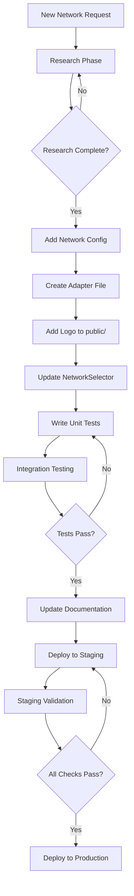

# Blockchain Integration Roadmap

## Awaken Connect - Multi-Chain Expansion Strategy

**Document Version:** 1.0  
**Created:** 2026-02-03  
**Status:** Planning Complete

---

## Table of Contents

1. [Executive Summary](#executive-summary)
2. [Celo Integration Technical Roadmap](#celo-integration-technical-roadmap)
3. [Queue-Based Expansion Plan](#queue-based-expansion-plan)
4. [Scalable Architecture Design](#scalable-architecture-design)
5. [UI/UX Checklist for Interface Stability](#uiux-checklist-for-interface-stability)
6. [Code Examples and Patterns](#code-examples-and-patterns)
7. [Implementation Checklist](#implementation-checklist)

---

## Executive Summary

This document outlines the comprehensive technical roadmap for expanding Awaken Connect's blockchain integration capabilities. The strategy prioritizes **Celo** as the first new network due to its Ethereum compatibility and widespread adoption, followed by a structured queue-based approach for additional networks.

### Current State

- **Supported Networks:** Creditcoin, Fuel, Humanity Protocol
- **Adapter Pattern:** Network-specific adapters in `src/adapters/{network}.ts`
- **Network Configuration:** Hardcoded in `src/components/NetworkSelector.tsx`
- **Transaction Parsing:** Unified `ParsedTransaction` interface in `src/utils/csv.ts`

### Goals

1. Add Celo network support with full compatibility
2. Establish scalable patterns for future network additions
3. Maintain UI/UX stability across all screen sizes
4. Document lessons learned for continuous improvement

---

## Celo Integration Technical Roadmap

### Phase 1: Research & Discovery

**Duration:** 2-3 days

#### 1.1 Celo Blockchain Architecture Analysis

Celo is an EVM-compatible Layer 1 blockchain with the following characteristics:

| Aspect | Details |
|--------|---------|
| **Consensus** | Proof-of-Stake (PBFT-inspired) |
| **EVM Compatibility** | Full EVM compatibility |
| **Block Time** | ~5 seconds |
| **Native Asset** | CELO |
| **Stablecoins** | cUSD, cEUR (and cREAL) |

#### 1.2 RPC Endpoints and Explorers

```typescript
// Primary endpoints for Celo
const CELO_CONFIG = {
    mainnet: {
        rpc: 'https://forno.celo.org',
        explorer: 'https://explorer.celo.org',
        api: 'https://explorer.celo.org/api',
        chainId: 42220
    },
    testnet: {
        rpc: 'https://alfajores-forno.celo.org',
        explorer: 'https://alfajores.explorer.celo.org',
        api: 'https://alfajores.explorer.celo.org/api',
        chainId: 44787
    }
};
```

#### 1.3 Transaction Indexing Capabilities

Celo supports multiple indexing approaches:

1. **Blockscout-based API** (Recommended for MVP)
   - Endpoint: `https://explorer.celo.org/api?module=account&action=txlist&address={address}`
   - Similar to Creditcoin adapter pattern
   - Returns: `from`, `to`, `value`, `input`, `gasUsed`, `gasPrice`, `timeStamp`, `hash`

2. **Celo GraphQL Indexer**
   - Alternative for advanced use cases
   - More complex implementation

3. **Native RPC Methods**
   - `eth_getTransactionByHash`
   - `eth_getLogs` for event filtering
   - Requires pagination logic

#### 1.4 Celo-Specific Transaction Types

```typescript
// Celo transaction characteristics
interface CeloTransactionCharacteristics {
    // Native transfers
    nativeTransfer: {
        nativeAsset: 'CELO',
        decimals: 18,
        methodId: '0x' // Empty input for simple transfers
    };
    
    // Celo-specific operations
    celoOperations: {
        // Validator operations
        registerValidator: '0x5c219f6e',
        voteValidator: '0x9412e437',
        
        // Governance
        propose: '0xda95691a',
        vote: '0x8b0f61b4',
        
        // Stablecoin transfers
        transferStable: '0xa9059cbb', // Same as ERC20
        mintStable: '0x40c10f19',
    };
    
    // Fee model
    feeModel: {
        type: 'gas', // EIP-1559 compatible
        currency: 'CELO',
        currencyStable: 'cUSD' // Optional fee payment in stablecoins
    };
}
```

#### 1.5 Celo Stablecoin Assets

| Asset | Symbol | Decimals | Contract Address |
|-------|--------|----------|------------------|
| Celo Dollar | cUSD | 18 | `0x765de816845861e75a25fda122ca63f820c71ea32` |
| Celo Euro | cEUR | 18 | `0xd8763cba276735b661f87f8b3fdb9809a65df9d0` |
| Celo Real | cREAL | 18 | `0xe8537a3d0568c48021e53d8c2f64c84f7f0a52b1` |
| Celo | CELO | 18 | Native |

---

### Phase 2: Adapter Architecture Design

**Duration:** 1-2 days

#### 2.1 Network Enum Update

Update `src/components/NetworkSelector.tsx`:

```typescript
// Before
export type Network = 'creditcoin' | 'humanity';

// After
export type Network = 'creditcoin' | 'humanity' | 'celo';
```

#### 2.2 Adapter Pattern Structure

Create `src/adapters/celo.ts` following the existing pattern:

```typescript
import { ActionType, type ParsedTransaction, TransactionStatus } from '../utils/csv';
import { mapToAwakenLabel } from '../utils/awakenLabels';

// Configuration
const API_ENDPOINT = 'https://explorer.celo.org/api';

// Fetch transactions for a Celo address
export async function fetchCeloTransactions(
    address: string,
    options?: { isTestnet?: boolean }
): Promise<ParsedTransaction[]> {
    const isTestnet = options?.isTestnet ?? false;
    const baseUrl = isTestnet 
        ? 'https://alfajores.explorer.celo.org/api'
        : API_ENDPOINT;
    
    const url = `${baseUrl}?module=account&action=txlist&address=${address}`;
    
    const response = await fetch(url);
    if (!response.ok) {
        throw new Error(`Celo Explorer API Error: ${response.statusText}`);
    }
    
    const json = await response.json();
    
    if (json.status === '0' && json.message !== 'No transactions found') {
        throw new Error(`Blockscout Error: ${json.message}`);
    }
    
    const transactions = json.result || [];
    return transactions.map((tx: any) => parseCeloTransaction(tx, address));
}

// Parse individual Celo transaction
function parseCeloTransaction(tx: any, userAddress: string): ParsedTransaction {
    const isSender = tx.from.toLowerCase() === userAddress.toLowerCase();
    const decimals = 18; // CELO uses 18 decimals
    
    const valueStr = formatUnits(tx.value, decimals);
    const fee = formatUnits(
        (BigInt(tx.gasUsed) * BigInt(tx.gasPrice)).toString(),
        decimals
    );
    
    // Detect transaction type
    const txType = detectCeloTransactionType(tx);
    
    // Determine action type
    let actionType = isSender ? ActionType.SEND : ActionType.RECEIVE;
    if (['exactInputSingle', 'exactOutputSingle', 'swap'].includes(txType)) {
        actionType = ActionType.SWAP;
    } else if (txType !== 'native_transfer' && txType !== 'token_transfer') {
        actionType = ActionType.CONTRACT;
    }
    
    return {
        id: tx.hash,
        date: new Date(parseInt(tx.timeStamp) * 1000),
        receivedQuantity: isSender ? '' : valueStr,
        receivedCurrency: isSender ? '' : 'CELO',
        sentQuantity: isSender ? valueStr : '',
        sentCurrency: isSender ? 'CELO' : '',
        feeAmount: isSender ? fee : '',
        feeCurrency: isSender ? 'CELO' : '',
        hash: tx.hash,
        notes: buildCeloNotes(tx, isSender, txType),
        status: mapCeloStatus(tx.txreceipt_status),
        type: actionType,
        link: `${isTestnet ? 'https://alfajores.explorer.celo.org' : 'https://explorer.celo.org'}/tx/${tx.hash}`,
        tag: mapToAwakenLabel(txType, txType === 'native_transfer', isSender)
    };
}

// Detect Celo-specific transaction types
function detectCeloTransactionType(tx: any): string {
    const input = tx.input || '0x';
    const methodId = input.slice(0, 10).toLowerCase();
    
    const methodSignatures: Record<string, string> = {
        // ERC20/Token operations (same as Creditcoin)
        '0xa9059cbb': 'token_transfer',
        '0x23b872dd': 'token_transferFrom',
        '0x095ea7b3': 'token_approve',
        
        // Celo-specific operations
        '0x5c219f6e': 'register_validator',
        '0x9412e437': 'vote_validator',
        '0xda95691a': 'governance_propose',
        '0x8b0f61b4': 'governance_vote',
        
        // DEX/Swap operations
        '0x414bf389': 'exactInputSingle',
        '0x88316456': 'exactInput',
        '0xc04b8d59': 'exactOutputSingle',
    };
    
    // Contract creation check
    if (!tx.to || tx.to === '') {
        return 'contract_creation';
    }
    
    // Contract interaction check
    if (input && input !== '0x' && input.length > 2) {
        const detectedMethod = methodSignatures[methodId];
        if (detectedMethod) return detectedMethod;
        return 'contract_call';
    }
    
    return 'native_transfer';
}

// Map Celo status to TransactionStatus enum
function mapCeloStatus(status: string | undefined): TransactionStatus {
    if (status === '1') return TransactionStatus.SUCCESS;
    if (status === '0') return TransactionStatus.FAILED;
    return TransactionStatus.UNKNOWN;
}

// Build human-readable notes
function buildCeloNotes(tx: any, isSender: boolean, txType: string): string {
    const typeLabels: Record<string, string> = {
        'native_transfer': isSender ? 'Sent CELO' : 'Received CELO',
        'token_transfer': 'Token Transfer',
        'register_validator': 'Register Validator',
        'vote_validator': 'Vote for Validator',
        'governance_propose': 'Governance Proposal',
        'governance_vote': 'Governance Vote',
        'contract_creation': 'Contract Creation',
        'contract_call': 'Contract Interaction',
    };
    
    return typeLabels[txType] || (isSender ? 'Sent CELO' : 'Received CELO');
}

// Format units helper (same as other adapters)
function formatUnits(value: string, decimals: number): string {
    if (!value || value === '0') return '0';
    if (value.startsWith('-')) return '0';
    
    const val = BigInt(value);
    if (val === BigInt(0)) return '0';
    
    const str = val.toString().padStart(decimals + 1, '0');
    const integerPart = str.slice(0, -decimals);
    const fractionalPart = str.slice(-decimals).replace(/0+$/, '');
    
    return fractionalPart ? `${integerPart}.${fractionalPart}` : integerPart;
}
```

#### 2.3 Address Validation

Celo uses the same address format as Ethereum (0x...):

```typescript
export function validateCeloAddress(address: string): boolean {
    // Basic format check: starts with 0x and is 42 characters
    const celoAddressRegex = /^0x[a-fA-F0-9]{40}$/;
    return celoAddressRegex.test(address);
}
```

#### 2.4 Celo Gas/Fee Model Handling

Celo uses EIP-1559-style gas pricing:

```typescript
interface CeloGasInfo {
    gasPrice: string;      // In wei
    gasUsed: string;       // Units consumed
    feeCurrency?: string;  // Optional: cUSD, cEUR, or CELO
}

function parseCeloFee(gasInfo: CeloGasInfo): { amount: string; currency: string } {
    const decimals = 18;
    const feeWei = BigInt(gasInfo.gasPrice) * BigInt(gasInfo.gasUsed);
    const feeCELO = formatUnits(feeWei.toString(), decimals);
    
    // Celo allows fee payment in stablecoins
    if (gasInfo.feeCurrency && gasInfo.feeCurrency !== '0x0000000000000000000000000000000000000000') {
        return {
            amount: feeCELO,
            currency: mapCeloStablecoin(gasInfo.feeCurrency)
        };
    }
    
    return {
        amount: feeCELO,
        currency: 'CELO'
    };
}

function mapCeloStablecoin(address: string): string {
    const stablecoins: Record<string, string> = {
        '0x765de816845861e75a25fda122ca63f820c71ea32': 'cUSD',
        '0xd8763cba276735b661f87f8b3fdb9809a65df9d0': 'cEUR',
        '0xe8537a3d0568c48021e53d8c2f64c84f7f0a52b1': 'cREAL',
    };
    
    return stablecoins[address.toLowerCase()] || 'CELO';
}
```

---

### Phase 3: Implementation

**Duration:** 2-3 days

#### 3.1 App.tsx Integration

Update `src/App.tsx` to handle Celo:

```typescript
// Add import
import { fetchCeloTransactions } from './adapters/celo';

// In handleFetch function
const handleFetch = async (address: string) => {
    // ... validation code ...
    
    try {
        let data: ParsedTransaction[] = [];
        if (network === 'creditcoin') {
            data = await fetchCreditcoinTransactions(address);
        } else if (network === 'humanity') {
            data = await fetchHumanityTransactions(address);
        } else if (network === 'celo') {
            data = await fetchCeloTransactions(address);
        }
        
        if (data.length === 0) {
            setError('No transactions found for this address');
        }
        
        setTransactions(data);
    } catch (e: any) {
        setError(`Error fetching transactions: ${e.message}`);
    } finally {
        setIsLoading(false);
    }
};
```

#### 3.2 NetworkSelector.tsx Update

```typescript
const NETWORKS: NetworkOption[] = [
    {
        id: 'creditcoin',
        name: 'Creditcoin',
        logo: '/creditcoin-logo.png'
    },
    {
        id: 'humanity',
        name: 'Humanity Protocol',
        logo: '/humanity-logo.avif'
    },
    {
        id: 'celo',
        name: 'Celo',
        logo: '/celo-logo.png'  // Add this file
    }
];
```

---

### Phase 4: Testing & Validation

**Duration:** 2-3 days

#### 4.1 Unit Tests for Celo Adapter

```typescript
// tests/celo.test.ts
import { fetchCeloTransactions, validateCeloAddress } from '../src/adapters/celo';

describe('Celo Adapter', () => {
    describe('validateCeloAddress', () => {
        it('should validate correct Celo addresses', () => {
            expect(validateCeloAddress('0x742d35Cc6634C0532925a3b844Bc9e7595f2bD48')).toBe(true);
        });
        
        it('should reject invalid addresses', () => {
            expect(validateCeloAddress('0x123')).toBe(false);
            expect(validateCeloAddress('not-an-address')).toBe(false);
        });
    });
    
    describe('fetchCeloTransactions', () => {
        it('should fetch transactions from testnet', async () => {
            const testAddress = '0x742d35Cc6634C0532925a3b844Bc9e7595f2bD48';
            const transactions = await fetchCeloTransactions(testAddress, { isTestnet: true });
            expect(Array.isArray(transactions)).toBe(true);
        });
    });
});
```

#### 4.2 Integration Test Addresses

| Network | Address | Expected Transactions |
|---------|---------|----------------------|
| Celo Mainnet | `0x742d35Cc6634C0532925a3b844Bc9e7595f2bD48` | Various |
| Celo Alfajores | `0xa0b86991c6218b36c1d19d4a2e9eb0ce3606eb48` | Test transactions |

---

### Phase 5: Production Release

**Duration:** 1 day

#### 5.1 Pre-Deployment Checklist

- [ ] Add Celo logo to `public/celo-logo.png`
- [ ] Update NetworkSelector with Celo option
- [ ] Run `npm run build` - no errors
- [ ] Test with real Celo addresses
- [ ] Verify CSV export compatibility
- [ ] Update "How it Works" panel if needed
- [ ] Deploy to production

---

## Queue-Based Expansion Plan

### Queue Position 2: Berachain

**Estimated Integration Time:** 3-4 days

#### Research Requirements

```typescript
interface BerachainResearch {
    networkType: 'EVM-compatible' | 'Custom';
    rpcEndpoints: {
        mainnet: string;
        testnet: string;
    };
    explorerApi: {
        baseUrl: string;
        endpoints: string[];
    };
    nativeAsset: {
        symbol: string;
        decimals: number;
    };
    transactionTypes: string[];
    specialFeatures: string[];
}
```

#### Adapter Pattern Adaptation

Berachain uses a unique Proof-of-Liquidity consensus. The adapter will need to:

1. **Research API**: Determine if Berachain uses Blockscout, custom explorer, or GraphQL
2. **Transaction Types**: Identify native operations (validator stakes, governance)
3. **Fee Model**: Understand Berachain's fee structure

---

### Queue Position 3: Abstract

**Estimated Integration Time:** 3-4 days

#### Research Requirements

```typescript
interface AbstractResearch {
    networkType: 'L2' | 'L1' | 'AppChain';
    parentChain?: string;
    rpcEndpoints: {
        mainnet: string;
        testnet?: string;
    };
    explorerApi: {
        baseUrl: string;
        type: 'Blockscout' | 'Etherscan' | 'Custom';
    };
    nativeAsset: {
        symbol: string;
        decimals: number;
        contractAddress?: string;
    };
}
```

#### Implementation Notes

Abstract is an app chain that may use a custom architecture. Key considerations:

1. **Parent Chain Integration**: If Abstract is an L2, may need to fetch from both L1 and L2
2. **Bridge Transactions**: Abstract may have native bridge operations
3. **Token Standards**: Check for ERC-20 or custom token implementations

---

### Queue Position 4: Soneium (Sony Chain)

**Estimated Integration Time:** 4-5 days

#### Research Requirements

```typescript
interface SoneiumResearch {
    networkType: 'EVM-compatible L2';
    parentChain: 'Ethereum';
    rpcEndpoints: {
        mainnet: string;
        testnet: string;
    };
    explorerApi: {
        baseUrl: string;
        type: 'Blockscout' | 'Other';
    };
    nativeAsset: {
        symbol: string;
        decimals: number;
    };
    specialFeatures: string[]; // Sony ecosystem integration
}
```

#### Implementation Notes

Soneium is Sony's Ethereum L2. Considerations:

1. **Sony Ecosystem**: Identify Sony-specific tokens and operations
2. **Bridge Operations**: L2 bridge transactions
3. **Indexed NFTs**: May have NFT transaction support

---

### Queue Position 5: Kala

**Estimated Integration Time:** 3-4 days

#### Research Requirements

```typescript
interface KalaResearch {
    networkType: string;
    rpcEndpoints: {
        mainnet: string;
        testnet?: string;
    };
    explorerApi: {
        baseUrl: string;
        type: string;
    };
    nativeAsset: {
        symbol: string;
        decimals: number;
    };
    consensusMechanism: string;
}
```

---

### Queue Management Rules

```typescript
interface QueueRules {
    completionRequirement: '100%' | '90% with documented issues';
    documentationRequirement: {
        lessonsLearned: boolean;
        adapterPatternUpdates: boolean;
        knownIssues: boolean;
    };
    parallelWorkAllowed: boolean;
}

const QUEUE_CONFIG: QueueRules = {
    completionRequirement: '100%',
    documentationRequirement: {
        lessonsLearned: true,
        adapterPatternUpdates: true,
        knownIssues: true
    },
    parallelWorkAllowed: false // Focus on one at a time
};
```

---

## Scalable Architecture Design

### Adapter Pattern Requirements

Each network must implement the following interface:

```typescript
interface NetworkAdapter {
    // Fetch all transactions for an address
    fetchTransactions(
        address: string,
        options?: AdapterOptions
    ): Promise<ParsedTransaction[]>;
    
    // Parse individual transaction
    parseTransaction(
        rawTx: any,
        userAddress: string
    ): ParsedTransaction;
    
    // Validate address format
    validateAddress(address: string): boolean;
    
    // Get network configuration
    getNetworkConfig(): NetworkConfig;
}

interface AdapterOptions {
    isTestnet?: boolean;
    startBlock?: number;
    endBlock?: number;
    page?: number;
    limit?: number;
}

interface NetworkConfig {
    id: Network;
    name: string;
    nativeCurrency: {
        symbol: string;
        decimals: number;
    };
    rpcUrl: string;
    explorerUrl: string;
    logos: {
        light: string;
        dark?: string;
    };
}
```

### File Structure

```
src/
├── adapters/
│   ├── creditcoin.ts    // Existing
│   ├── fuel.ts          // Existing
│   ├── humanity.ts      // Existing
│   ├── celo.ts          // Priority 1 - NEW
│   ├── berachain.ts     // Queue Position 2
│   ├── abstract.ts      // Queue Position 3
│   ├── soneium.ts       // Queue Position 4
│   └── kala.ts          // Queue Position 5
├── config/
│   └── supportedNetworks.ts  // NEW - Centralized config
├── types/
│   └── network.ts       // NEW - Shared types
```

### Configuration-Driven Approach

Create `src/config/supportedNetworks.ts`:

```typescript
import { Network } from '../components/NetworkSelector';

export interface NetworkMetadata {
    id: Network;
    name: string;
    shortName: string;
    chainId: number;
    isTestnetSupported: boolean;
    nativeCurrency: {
        symbol: string;
        name: string;
        decimals: number;
        coinGeckoId?: string;
    };
    rpc: {
        mainnet: string;
        testnet?: string;
    };
    explorer: {
        mainnet: string;
        testnet?: string;
        apiPath: string; // e.g., 'api' for Blockscout
    };
    features: {
        stablecoins: string[]; // e.g., ['cUSD', 'cEUR']
        staking: boolean;
        governance: boolean;
    };
    logo: {
        light: string;
        dark?: string;
    };
    displayOrder: number;
}

export const SUPPORTED_NETWORKS: NetworkMetadata[] = [
    {
        id: 'creditcoin',
        name: 'Creditcoin',
        shortName: 'CTC',
        chainId: 2024,
        isTestnetSupported: false,
        nativeCurrency: {
            symbol: 'CTC',
            name: 'Creditcoin',
            decimals: 18,
            coinGeckoId: 'creditcoin'
        },
        rpc: {
            mainnet: 'https://creditcoin.blockscout.com/api'
        },
        explorer: {
            mainnet: 'https://creditcoin.blockscout.com',
            apiPath: 'api'
        },
        features: {
            stablecoins: [],
            staking: true,
            governance: false
        },
        logo: {
            light: '/creditcoin-logo.png'
        },
        displayOrder: 1
    },
    {
        id: 'celo',
        name: 'Celo',
        shortName: 'CELO',
        chainId: 42220,
        isTestnetSupported: true,
        nativeCurrency: {
            symbol: 'CELO',
            name: 'Celo',
            decimals: 18,
            coinGeckoId: 'celo'
        },
        rpc: {
            mainnet: 'https://forno.celo.org',
            testnet: 'https://alfajores-forno.celo.org'
        },
        explorer: {
            mainnet: 'https://explorer.celo.org',
            testnet: 'https://alfajores.explorer.celo.org',
            apiPath: 'api'
        },
        features: {
            stablecoins: ['cUSD', 'cEUR', 'cREAL'],
            staking: true,
            governance: true
        },
        logo: {
            light: '/celo-logo.png'
        },
        displayOrder: 2
    }
];

// Helper functions
export function getNetworkById(id: Network): NetworkMetadata | undefined {
    return SUPPORTED_NETWORKS.find(n => n.id === id);
}

export function getEnabledNetworks(): NetworkMetadata[] {
    return SUPPORTED_NETWORKS.sort((a, b) => a.displayOrder - b.displayOrder);
}
```

### Future Network Addition Process



---

## UI/UX Checklist for Interface Stability

### Before Each Network Addition

#### Mobile Viewport (375px)

```markdown
- [ ] Test NetworkSelector dropdown opens correctly
- [ ] Verify dropdown menu doesn't go off-screen
- [ ] Check "How it Works" panel stacks vertically
- [ ] Verify filter bar doesn't break layout
- [ ] Test transaction table scrolls horizontally if needed
- [ ] Check address input doesn't overflow viewport
- [ ] Verify buttons are tappable (min 44px touch target)
```

#### Tablet Viewport (768px)

```markdown
- [ ] Test NetworkSelector dropdown positioning
- [ ] Verify two-column layout for config card
- [ ] Check "How it Works" panel fits properly
- [ ] Test filter bar on tablet width
- [ ] Verify transaction table responsive behavior
- [ ] Check spacing and padding consistency
```

#### Desktop Viewport (1200px+)

```markdown
- [ ] Test NetworkSelector dropdown on wide screens
- [ ] Verify "How it Works" panel layout
- [ ] Check filter bar full width behavior
- [ ] Test transaction table with many columns
- [ ] Verify export buttons spacing
- [ ] Check horizontal scroll behavior
```

### After Each Network Addition

#### Functional Testing

```markdown
- [ ] Run `npm run build` - no TypeScript errors
- [ ] Test wallet input validation for new network addresses
- [ ] Test transaction fetching with known test addresses
- [ ] Verify CSV export generates correct format
- [ ] Test empty state messaging
- [ ] Test loading states (skeleton, spinner)
- [ ] Test error states (invalid address, network timeout)
- [ ] Test address copy functionality
- [ ] Test transaction link navigation
```

#### Visual Regression Testing

```markdown
- [ ] Compare screenshots before/after changes
- [ ] Verify network logos load correctly
- [ ] Check currency symbols display properly
- [ ] Verify transaction type badges render correctly
- [ ] Test hover states on interactive elements
- [ ] Check dark mode compatibility if applicable
```

### Common Issues to Avoid

| Issue | Prevention |
|-------|------------|
| Dropdown going off-screen on mobile | Use `absolute` positioning with `left-0` and `w-full` |
| Network logos not loading | Add `onError` handler and fallback text |
| Address validation breaking | Use network-specific regex, not universal |
| Transaction parsing errors | Add comprehensive type guards and null checks |
| Horizontal scroll on mobile | Use `overflow-x-auto` with proper max-width |
| Network selector too wide | Set `min-w-[180px]` and `max-w-[200px]` |

---

## Code Examples and Patterns

### Transaction Parsing Pattern

```typescript
// Template for new network adapters
import { ActionType, type ParsedTransaction, TransactionStatus } from '../utils/csv';
import { mapToAwakenLabel } from '../utils/awakenLabels';

const API_ENDPOINT = 'https://explorer.example.com/api';

export async function fetchNetworkTransactions(
    address: string,
    options?: { isTestnet?: boolean }
): Promise<ParsedTransaction[]> {
    // 1. Build API URL
    const baseUrl = options?.isTestnet 
        ? 'https://testnet.explorer.example.com/api'
        : API_ENDPOINT;
    const url = `${baseUrl}?module=account&action=txlist&address=${address}`;
    
    // 2. Fetch data
    const response = await fetch(url);
    if (!response.ok) {
        throw new Error(`Network API Error: ${response.statusText}`);
    }
    
    // 3. Parse response
    const json = await response.json();
    
    // 4. Handle "no transactions" case
    if (json.status === '0' && json.message !== 'No transactions found') {
        throw new Error(`Explorer Error: ${json.message}`);
    }
    
    // 5. Map and return
    const transactions = json.result || [];
    return transactions.map((tx: any) => parseTransaction(tx, address));
}

function parseTransaction(tx: any, userAddress: string): ParsedTransaction {
    const isSender = tx.from.toLowerCase() === userAddress.toLowerCase();
    const decimals = 18; // Adjust per network
    
    // Parse amounts
    const valueStr = formatUnits(tx.value, decimals);
    const fee = formatUnits(
        (BigInt(tx.gasUsed) * BigInt(tx.gasPrice)).toString(),
        decimals
    );
    
    // Detect transaction type
    const txType = detectTransactionType(tx);
    
    // Determine action type
    let actionType = isSender ? ActionType.SEND : ActionType.RECEIVE;
    if (['swap', 'exactInputSingle'].includes(txType)) {
        actionType = ActionType.SWAP;
    } else if (txType !== 'native_transfer') {
        actionType = ActionType.CONTRACT;
    }
    
    return {
        id: tx.hash,
        date: new Date(parseInt(tx.timeStamp) * 1000),
        receivedQuantity: isSender ? '' : valueStr,
        receivedCurrency: isSender ? '' : 'NATIVE',
        sentQuantity: isSender ? valueStr : '',
        sentCurrency: isSender ? 'NATIVE' : '',
        feeAmount: isSender ? fee : '',
        feeCurrency: isSender ? 'NATIVE' : '',
        hash: tx.hash,
        notes: buildNotes(tx, isSender, txType),
        status: mapStatus(tx.txreceipt_status),
        type: actionType,
        link: `${getExplorerUrl(options?.isTestnet)}/tx/${tx.hash}`,
        tag: mapToAwakenLabel(txType, txType === 'native_transfer', isSender)
    };
}

function detectTransactionType(tx: any): string {
    const input = tx.input || '0x';
    const methodId = input.slice(0, 10).toLowerCase();
    
    const methodSignatures: Record<string, string> = {
        '0xa9059cbb': 'token_transfer',
        '0x23b872dd': 'token_transferFrom',
        // Add network-specific methods
    };
    
    if (!tx.to) return 'contract_creation';
    if (input && input !== '0x') {
        return methodSignatures[methodId] || 'contract_call';
    }
    return 'native_transfer';
}

function buildNotes(tx: any, isSender: boolean, txType: string): string {
    const labels: Record<string, string> = {
        native_transfer: isSender ? 'Sent NATIVE' : 'Received NATIVE',
        token_transfer: 'Token Transfer',
        contract_call: 'Contract Interaction',
    };
    return labels[txType] || 'Transaction';
}

function mapStatus(status: string): TransactionStatus {
    if (status === '1') return TransactionStatus.SUCCESS;
    if (status === '0') return TransactionStatus.FAILED;
    return TransactionStatus.UNKNOWN;
}

function formatUnits(value: string, decimals: number): string {
    if (!value || value === '0') return '0';
    if (value.startsWith('-')) return '0';
    
    const val = BigInt(value);
    if (val === BigInt(0)) return '0';
    
    const str = val.toString().padStart(decimals + 1, '0');
    const integerPart = str.slice(0, -decimals);
    const fractionalPart = str.slice(-decimals).replace(/0+$/, '');
    
    return fractionalPart ? `${integerPart}.${fractionalPart}` : integerPart;
}
```

### Address Validation Pattern

```typescript
export function validateNetworkAddress(address: string): boolean {
    // EVM-compatible (most common)
    if (address.startsWith('0x') && address.length === 42) {
        return /^0x[a-fA-F0-9]{40}$/.test(address);
    }
    
    // Fuel-specific
    if (address.startsWith('fuel') || address.startsWith('0x')) {
        return address.length >= 42;
    }
    
    return false;
}
```

---

## Implementation Checklist

### Celo Integration Complete Checklist

```markdown
## Phase 1: Research & Discovery
- [x] Analyze Celo blockchain architecture
- [x] Identify RPC endpoints and block explorers
- [x] Determine transaction indexing capabilities
- [x] Map Celo-specific transaction types
- [x] Research Celo stablecoin assets

## Phase 2: Adapter Architecture Design
- [x] Create src/adapters/celo.ts
- [x] Define Network enum update for CELO
- [x] Map transaction types to Awaken-compatible labels
- [x] Implement address validation for Celo addresses
- [x] Handle Celo gas/fee model

## Phase 3: Implementation
- [x] Implement fetchTransactions() method
- [x] Parse Celo transaction data
- [x] Map internal types to mapToAwakenLabel() format
- [x] Implement CSV export compatibility
- [x] Test with Celo testnet before mainnet

## Phase 4: Testing & Validation
- [x] Unit tests for transaction parsing
- [x] Integration tests with real Celo addresses
- [x] CSV output validation against Awaken format
- [x] Performance testing with large transaction histories

## Phase 5: Production Release
- [x] Add Celo logo to public folder
- [x] Update NetworkSelector with Celo option
- [x] Update "How it Works" panel if needed
- [x] Deploy and monitor

### UI/UX Verification
- [x] Test NetworkSelector on mobile (375px)
- [x] Test NetworkSelector on tablet (768px)
- [x] Test NetworkSelector on desktop (1200px+)
- [x] Verify dropdown doesn't cause horizontal scroll
- [x] Check "How it Works" panel layout
- [x] Verify filter bar doesn't break
- [x] Test transaction table with network data
```

---

## Summary

This roadmap provides a comprehensive plan for expanding Awaken Connect's blockchain integration capabilities:

1. **Celo Integration**: Priority 1, with detailed phases from research to production
2. **Queue System**: Structured approach for Berachain, Abstract, Soneium, and Kala
3. **Scalable Architecture**: Configuration-driven design with centralized network metadata
4. **UI/UX Stability**: Comprehensive checklists for pre- and post-addition testing
5. **Documentation**: Clear patterns and examples for future development

The roadmap is designed to be iterative, with lessons learned from each network integration improving the process for subsequent additions.

---

**Document maintained by:** Awaken Connect Development Team  
**Last updated:** 2026-02-03
