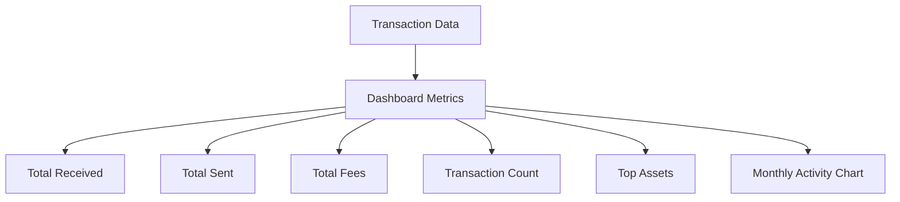
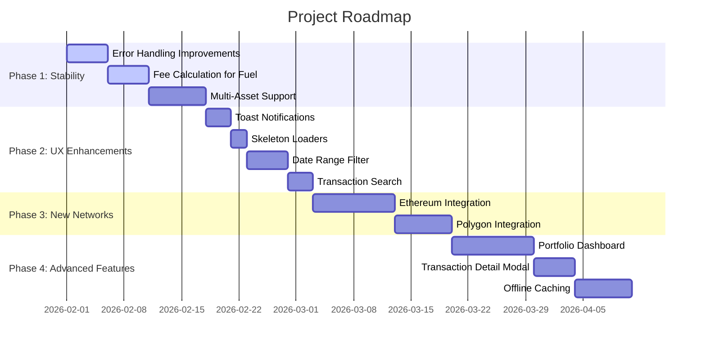

# Project Analysis Report: Awaken Connect

## Executive Summary

**Awaken Connect** is a Multi-Chain Transaction Exporter - a minimalist web application for fetching transaction history from specific blockchain networks and exporting them into a standardized CSV format compatible with the Awaken tax platform.

The project is well-structured, uses modern technologies (React 18, TypeScript, Vite, Tailwind CSS), and has a clean architecture with clear separation of concerns between adapters, components, and utilities.

---

## Current Architecture

### Project Structure

```
awaken_connect/
├── src/
│   ├── adapters/          # Network API integrations
│   │   ├── fuel.ts       # Fuel Network GraphQL integration
│   │   └── creditcoin.ts  # Creditcoin Blockscout API integration
│   ├── components/
│   │   ├── AddressInput.tsx
│   │   ├── NetworkSelector.tsx
│   │   ├── TransactionTable.tsx
│   │   └── ui/           # Reusable UI components (Radix-based)
│   ├── lib/
│   │   └── utils.ts      # Utility functions (cn class merger)
│   ├── utils/
│   │   ├── csv.ts        # CSV parsing/export logic
│   │   └── parser.ts     # Transaction parsing interfaces
│   ├── App.tsx           # Main application component
│   └── main.tsx          # Entry point
├── root-level debug scripts (exploratory/development)
└── Configuration files
```

### Tech Stack

| Category | Technology |
|----------|------------|
| **Framework** | React 18.2.0 |
| **Build Tool** | Vite 5.1.4 |
| **Language** | TypeScript 5.2.2 |
| **Styling** | Tailwind CSS 3.4.1 |
| **UI Components** | Radix UI primitives |
| **Icons** | Lucide React |
| **Utilities** | clsx, tailwind-merge, class-variance-authority |

### Current Features

1. **Multi-Network Support**
   - Fuel Network (Mainnet + Testnet)
   - Creditcoin Network

2. **Data Fetching**
   - GraphQL API integration for Fuel
   - REST API integration for Creditcoin via Blockscout
   - Pagination support (cursor-based for Fuel)
   - Address validation per network

3. **Data Display**
   - Sortable transaction table (date, type, status, amount)
   - Pagination (10 items per page)
   - Selection checkboxes for partial export
   - Status badges (Success, Failed, Pending)
   - External transaction links

4. **CSV Export**
   - Awaken-compatible format
   - Export selected or all transactions
   - Proper date formatting (MM/DD/YYYY HH:MM:SS)
   - Client-side generation (privacy-preserving)

---

## Identified Improvements

### High Priority

#### 1. **Error Handling & Retry Logic**
- **Current**: Simple `alert()` for errors
- **Improvement**: Implement toast notifications, retry mechanisms, and graceful error states
- **Impact**: Better UX during network failures

#### 2. **Loading States Optimization**
- **Current**: Basic `isLoading` state
- **Improvement**: 
  - Skeleton loaders for table
  - Progress indicator for pagination fetching
  - Cancelable requests (AbortController)
- **Impact**: Perceived performance improvement

#### 3. **Fuel Adapter Fee Calculation**
- **Current**: Fee amount hardcoded as empty string
- **Issue**: Fuel transactions include gas fees that should be captured
- **Fix**: Extend GraphQL query to fetch receipt data for gas calculation
- **Impact**: Complete transaction data for tax reporting

#### 4. **Multi-Asset Support**
- **Current**: Hardcoded currency as "ETH" for Fuel, "CTC" for Creditcoin
- **Issue**: Fuel supports multiple assets (tokens)
- **Fix**: Parse `assetId` from inputs/outputs and map to token names
- **Impact**: Accurate multi-asset portfolio tracking

### Medium Priority

#### 5. **Address Book / History**
- **Feature**: Store previously queried addresses locally
- **Benefit**: Quick access to frequently used addresses
- **Implementation**: LocalStorage with CRUD operations

#### 6. **Date Range Filtering**
- **Feature**: Filter transactions by date range
- **Benefit**: Export only relevant periods (e.g., tax year)
- **UI**: Date picker inputs above the table

#### 7. **Transaction Search**
- **Feature**: Search by transaction hash, amount, or notes
- **Benefit**: Quick navigation in large transaction sets
- **Implementation**: Client-side filtering with debounce

#### 8. **Better Address Validation**
- **Current**: Basic regex checks
- **Issue**: Doesn't validate checksum, may accept invalid addresses
- **Fix**: Use checksum libraries (e.g., `ethers` or custom validation)

#### 9. **Responsive Design for Mobile**
- **Current**: Works but table layout may be cramped
- **Improvement**: 
  - Card view for mobile
  - Horizontal scroll for table
  - Collapsible columns

### Low Priority

#### 10. **Export Options**
- **Feature**: Multiple export formats (CSV, JSON, Excel)
- **Benefit**: Compatibility with different tax platforms
- **Implementation**: Additional utility functions for different formats

#### 11. **API Endpoint Configuration**
- **Feature**: Allow users to configure custom API endpoints
- **Benefit**: Flexibility for enterprise users or alternative RPCs
- **UI**: Settings panel or URL parameter override

#### 12. **Analytics Dashboard**
- **Feature**: Summary stats (total sent/received, fees paid, transaction count)
- **Benefit**: Quick overview before export
- **Implementation**: Summary cards above the table

---

## New Feature Recommendations

### 1. **Humanity Protocol Integration** ⚡

Per the technical specification, Humanity Protocol support is planned but not implemented.

**Implementation Plan:**
```typescript
// New adapter: src/adapters/humanity.ts
export async function fetchHumanityTransactions(address: string): Promise<ParsedTransaction[]>
```

**Considerations:**
- Determine API endpoint (likely GraphQL or REST)
- Define transaction schema mapping
- Handle unique Humanity Protocol features (if any)

---

### 2. **Batch Export for Multiple Addresses**

**Feature**: Export transactions for multiple addresses in a single CSV.

**Use Case**: Users with multiple wallets consolidating tax data.

**UI Flow:**
1. Add multiple addresses (comma-separated or multi-line input)
2. Fetch all transactions in parallel
3. Merge and deduplicate by transaction hash
4. Single export file

---

### 3. **Portfolio Summary Dashboard**

**Feature**: Visual overview of transaction activity.



**Components:**
- Summary cards with big numbers
- Bar/line chart for monthly activity (using recharts or similar)
- Pie chart for asset distribution

---

### 4. **Transaction Detail Modal**

**Feature**: Click on transaction to view full details.

**Data to Display:**
- Full transaction hash (copyable)
- Block number (when available)
- Gas used / Gas price (for supported networks)
- Input data (hex)
- All participants (from/to addresses)

**Implementation:**
- Modal component using Radix Dialog
- Expandable rows in TransactionTable

---

### 5. **Offline Mode / Caching**

**Feature**: Cache fetched transactions locally.

**Benefits:**
- Faster subsequent loads
- Offline access to previously fetched data
- Reduced API calls

**Implementation:**
- IndexedDB or LocalStorage for cache
- Cache key: `${network}_${address}_${timestamp}`
- Cache expiry: configurable (e.g., 24 hours)

---

### 6. **Direct API Integration for Other Blockchains**

**Recommended Additions:**

| Priority | Network | Reason |
|----------|---------|--------|
| High | Ethereum | Most common, high demand for tax tools |
| High | Polygon | Popular L2, low fees |
| Medium | Arbitrum | Growing DeFi activity |
| Medium | Optimism | L2 adoption |

**Adapter Pattern:**
```typescript
// src/adapters/ethereum.ts
export async function fetchEthereumTransactions(
    address: string, 
    options?: { apiKey?: string; chainId?: number }
): Promise<ParsedTransaction[]>
```

---

### 7. **CSV Import / Merge**

**Feature**: Import existing CSV data and merge with newly fetched transactions.

**Use Cases:**
- Combine data from multiple sessions
- Add manual entries (e.g., from exchanges)
- Data backup/restore

**Implementation:**
- File upload component
- CSV parser using same schema
- Merge logic (deduplicate by hash, combine by date)

---

### 8. **Tax Year Summary Report**

**Feature**: Pre-calculated tax summaries.

**Data Points:**
- Total capital gains/losses (requires price data)
- Total transaction volume
- Fee deductions summary
- Income from staking/mining

**Note**: Requires price oracle integration (e.g., CoinGecko API) for historical pricing.

---

## Technical Debt & Code Quality

### Current Issues

1. **Duplicate Interfaces**
   - [`src/utils/parser.ts`](src/utils/parser.ts) defines `ParsedTransaction`
   - [`src/utils/csv.ts`](src/utils/csv.ts) also defines `ParsedTransaction`
   - **Action**: Consolidate to single source of truth

2. **Type Safety**
   - Some `any` types in error handling
   - **Action**: Replace with proper error types

3. **Missing Tests**
   - No unit or integration tests
   - **Action**: Add Vitest for utilities, React Testing Library for components

4. **Debug Scripts in Root**
   - Multiple `.js` files for development exploration
   - **Action**: Move to `scripts/` directory or remove

5. **Hardcoded Values**
   - Fee currency, token symbols
   - API endpoints
   - **Action**: Move to environment variables or config file

---

## Proposed Project Roadmap



---

## Recommendations Summary

### Immediate Actions (Week 1-2)
1. Fix Fuel fee calculation
2. Implement multi-asset parsing
3. Replace `alert()` with toast notifications
4. Consolidate duplicate interfaces

### Short-term (Month 1)
1. Add skeleton loaders
2. Implement date range filtering
3. Add transaction search
4. Implement address book with LocalStorage

### Medium-term (Quarter)
1. Add Ethereum support
2. Build portfolio dashboard
3. Implement transaction detail modal
4. Add caching layer

### Long-term
1. Support for 5+ blockchain networks
2. Tax summary reports
3. CSV import/merge functionality
4. Enterprise features (API keys, custom endpoints)

---

## Conclusion

Awaken Connect is a well-architected, minimalist solution for its current scope. The codebase is clean and maintainable. The recommended improvements focus on:

1. **Data completeness** (fees, multi-asset)
2. **User experience** (loading states, filtering, search)
3. **Scalability** (new networks, batch operations)
4. **Professional polish** (error handling, responsive design)

The project has strong potential to expand into a comprehensive multi-chain tax reporting tool.
